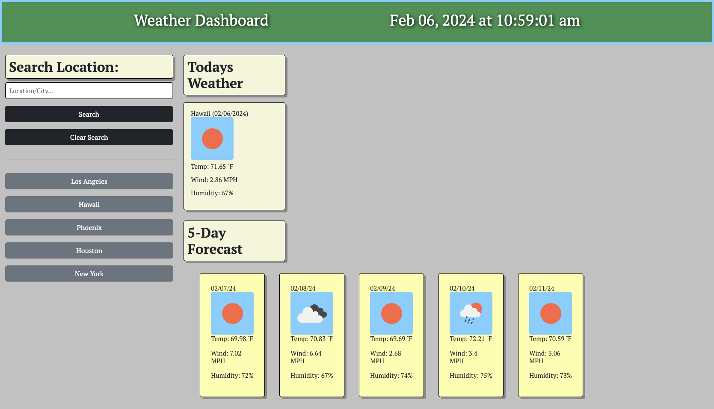

# weather-dashboard

## Description 

The weather dashboard created for this project was designed to be a very simple tool that displays current weather and a 5-day forecast. It demonstrates a basic weather applications functionality while using new skills such as bootstrap and css to structure the page. This project teaches you how to 'fetch' data from an api, pin point and display specific data values using jquery, dynamically display buttons using javascript, and the use of bootstrap properties in an html.

## Link to app
[Weather Dashboard][def]

[def]: https://nicoinlalaland.github.io/weather-dashboard/